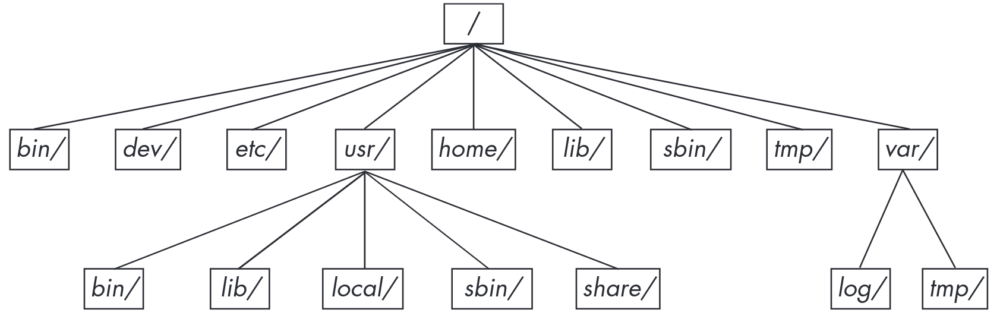

# Información del tema

## Tiempo estimado

Aproximadamente 30 minutos de clase con una actividad para casa de aproximadamente 10 minutos.

## Objetivos

Que los alumnos conozcan cómo se estructuran los sistemas UNIX, principalmente Debian GNU/Linux, aprendiendo a moverse en el sistema de archivos, conociendo que se almacena en cada lugar, la razón de cada ubicación.

# Introducción al tema

El sistema de archivos de UNIX es la forma en la que se organiza toda la información del sistema de tal modo que se pueda manejar.

Un archivo es la unidad más pequeña de información. Todo en UNIX se organiza en archivos los cuales a su vez se organiza por directorios. Los directorios se organizan en estructuras similares a árboles lo que terminamos llamando como sistema de archivos.

# Cosas a destacar

- Todo es tratado como archivo, incluso los dispositivos.
- Existen dos tipos de archivos de dispositivos
    - Bloque, estos suelen ser dispositivos de almacenamiento tradicionales como discos duros, de estado sólido, etc.
    - Carácter, estos son dispositivos donde pasa una corriente de bits en un orden en específico como el teclado o la pantalla.
- Cada archivo cuenta con ciertos permisos
- Cada archivo esta ligado a un inodo dentro del sistema de archivos, por lo que la misma información puede estar referenciada por varios archivos a la vez.
- Cada ruta es única, los sistemas suelen ser sensibles a mayúsculas y minúsculas.

# Sistema Tradicional

Es un sistema donde todo empieza en el directorio raíz `/`, de este se desprenden todas las rutas tradicionales del sistema.

# Subdirectorios importantes

- `/bin` Contiene programas listos para se ejecutados, la mayor parte de los programas en formato binario creados en lenguaje C pero también puede contener scripts.
- `/dev` Contiene archivos de dispositivos.
- `/etc` Contiene la configuración del sistema. Cosas como usuarios, contraseñas, configuración de aplicaciones, red, arranque, etc.
- `/home` Contiene los archivos personales de los usuarios regulares.
- `/lib` Contiene las bibliotecas, archivos que los programas ejecutables pueden usar. Suele contener solamente bibliotecas compartidas.
- `/proc` Contiene estadísticas del sistema de forma que se puede interactuar con el sistema mediante directorios y archivos.

# Subdirectorios importantes

- `/run` Contiene datos de tiempo de ejecución, archivos de socket, algunas bitácoras.
- `/sys` Similar a `/proc`, provee interfaces para dispositivos y el sistema.
- `/sbin` Lugar para ejecutables del sistemas, son binarios que se suelen solo utilizar mediante el usuario root.
- `/tmp` Suele ser pequeño, contiene archivos temporales, todos tienen acceso a este directorio. No debe tener archivos importantes pues el sistema suele limpiarlo constantemente.
- `/usr` Contiene una copia similar a `/`, con subdirectorios como `/usr/bin`, `/usr/lib` y este tipo de archivos. Se mantiene separado históricamente para mantener `/` chico.
- `/var` Contiene datos variables a lo largo del tiempo de los programas, cosas como bitácoras, cache, etc.

# Otros subdirectorios

- `/boot` Contiene los archivos del kernel y lo relacionado con el arranque.
- `/media` Un punto de montado de dispositivos que se pueden remover como memorias usb o sd.
- `/opt` Contiene software de terceros
