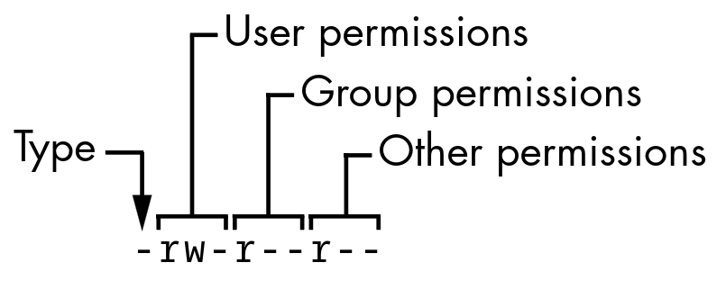

# Información del tema

## Tiempo estimado

Aproximadamente 60 minutos de clase.

## Objetivos

Que los alumnos comprendan como se manejan los permisos básicos en sistemas UNIX, principalmente Debían GNU/Linux, los permisos que suele tener cada usuario, como crearlos y el uso de umask.

# Introducción al tema

En linux los usuarios son individuos o entidades que interactúan con el sistema operativo para realizar ciertas tareas.

La administración de usuarios es importantes pues esta controla la seguridad y a lo que tiene acceso cada uno y su uso de recursos del sistema.

# Propiedades de un usuario

Aunque se suelte referir a un usuario por su username, el usuario cuenta con:

- UID
- GID
- Directorio home
- Shell default
- Contraseña

Cada usuario cuenta con estas características las cuales se pueden listar en `/etc/passwd`

# Tipos de usuario

## Usuario de sistema

Usuarios creados por el sistema durante la instalación e instalación de programas. Se usar para correr servicios y aplicaciones específicas.

## Usuario regular

Son mantenidos por un administrador. Estos pueden acceder al sistema y sus recursos basado en los permisos con proporcionados por el administrador.

# Administración de usuario

## Creación

```sh
adduser \\
    --home /path/to/home \\
    --system  \\
    --shell /bin/path/to/shell \\
    username
```

Siendo las banderas:

- `--system` Determina que el usuario es de sistema
- `--home` Determina la ubicación de el directorio hogar del usuario
- `--shell` Determina el entorno shell predeterminado del usuario

También se puede especificar `--uid` `--gid` para determinar un identificador predeterminado

# Administración de usuario

## Reconocer usuarios

Para reconocer los identificadores y a los grupos que pertenece un usuario se usa el comando `id`

```sh
id username
```

Como antes fue mencionado, `/etc/passwd` contiene información de los usuarios

```
username:passwd:UID:GID:
FullName,RoomNumber,WorkPhone,HomePhone,Other:
/path/to/home:/path/to/shell
```

# Administración de usuario

## Eliminar usuarios

```sh
userdel username
```

## Modificar usuarios

### Agregar un usuario a un grupo

```sh
usermod -aG NewGroup username
```

### Cambiar shell

```sh
usermod -s /bin/bash username
```

### Cambiar contraseña

```sh
passwd username
```

# Administración de grupos

## Creación de grupos

```
groupadd groupname
```

## Administración de grupos

Se puede encontrar la información de los grupos en `/etc/group`

# Permisos

Linux es un sistema operativo multi-usuarios, por lo mismo debemos de tener en cuenta permisos de acceso a la información.

Un archivo cuenta con dos características de acceso, propiedad y permisos.

# Propiedad

Cada archivo tiene dos tipos de dueños

## Usuario

Es el dueño del archivo, suele ser el creador del archivo y el que controla los permisos.

## Grupo

Es el grupo dueño del grupo, pueden ser varios usuarios y todos dentro del grupo tendrán los mismos niveles de acceso.

# Permisos

## Archivos

### Lectura

Puede ver y copiar los contenidos del archivo

### Escritura

Puede modificar los contenidos del archivo

### Ejecución

Puede ejecutar el archivo

# Permisos

## Directorios

### Lectura

Puede listar y copiar los archivos de un directorio

### Escritura

Puede agregar o borrar archivos del directorio (Necesita permisos de ejecución)

### Ejecución

Puede entrar al directorio

# Conocer permisos

Obtener todas las estadísticas de un usuario

```sh
stat /ruta/archivo
```

Listar los archivos de un directorio con sus permisos

```sh
ls -l /ruta/directorio
```

# Conocer permisos

Por ejemplo `/etc/passwd`

```
-rw-r--r--. 1 root root 923 Jul 29 05:00 /etc/passwd
```



# Conocer permisos

Tipo `-` es un archivo simple y `d` un directorio

## Permisos

- `r` Permiso de lectura
- `w` Permiso de escritura
- `x` Permiso de ejecución
- `-` Ningún permiso

# Modificar permisos

```sh
chmod g+r archivo
chmod o+r archivo
chmod go+r archivo
chmod go-r archivo
chmod 644 archivo
```

# Bits de permisos

- `0` : Ningún permiso
- `1` : Permiso de ejecución
- `2` : Permiso de escritura
- `4` : Permiso de lectura

Se pueden hacer sumas para juntar permisos, por ejemplo:

- `6` : Permiso de lectura y escritura
- `7` : Permiso de lectura, escritura y ejecución

# umask

Para asignar los permisos default de tu shell se usa `umask`

Se usa el sistema de bits de permisos de forma inversa, es decir, 0 es todos los permisos y 7 es ningún permiso. Es como ocultar estos permisos.

- `0` Todos los permisos
- `1` No hay permiso de ejecución
- `2` No hay permiso de escritura
- `4` No hay permiso de lectura

Se puede cambiar para todas tus shell agregándolo a `.bashrc` o temporalmente con el comando `umask`

# Actividad

## Cuestionario

- Bits de permisos para que solo el dueño pueda leer el archivo
- Bits de permisos para que cualquiera pueda explorar un directorio pero solo el dueño pueda modificar
- Bits de permisos de umask para que los archivos nuevos solo se puedan leer por el dueño
