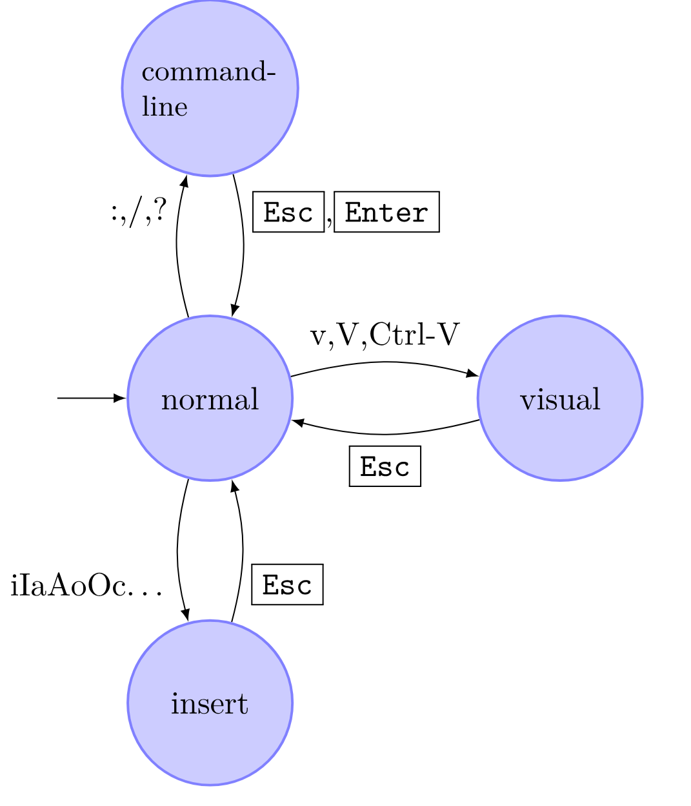

# Información del tema

## Tiempo estimado

Aproximadamente 60 minutos de clase, incluyendo algunos pequeños ejercicios de
repaso

## Objetivos

- Que los alumnos tengan en mente el concepto de editor de texto, así como
  algunos de los programas que cumplen esta función en un sistema Linux

- Que los alumnos puedan utilizar uno de los editores de texto generalmente
  incluidos en los sistemas Linux para la creación y modificación de archivos de
  texto.

# ¿Qué es un editor de texto?

Se trata simplemente de cualquier programa diseñado para la edición de archivos
de texto. 

Nos fijaremos en aquellos editores que se ejecutan en la terminal, pues pueden
utilizarse incluso cuando no se tiene acceso a una interfaz gráfica. Muchas
computadoras con el fin de actuar como servidores no incluyen una interfaz
gráfica.

Se usará un editor de texto cuando queramos modificar la configuración de algún
servicio en la computadora o cuando escribamos un *script*.


# Algunos editores de texto en la terminal

## `nano`

Su desarrollo empezó en 1999, como un reemplazo para el editor `pico`, pero con
más características y con una licencia libre.

Es muy usado por su relativa (con respecto a otros) facilidad de uso y a que
comúnmente viene ya instalado en la mayoría de distribuciones de Linux.

## `(neo)vi(m)`

`vi` es un editor de texto creado originalmente por Bill Joy en 1976 como un
modo visual para el ya existente editor `ex`. Su modelo modal lo convirtió a él
y a sus programas descendientes en algunos de los más eficientes para la edición
de texto.

A pesar de su eficiencia cuando se aprende su modelo de edición, puede resultar
muy complicado para una persona usándolo por primera vez.

# Usando `nano`

Se describirán algunas de las acciones más básicas que se pueden hacer con 

## Abriendo archivos

Para editar un archivo con `nano`, se utiliza un comando como el siguiente:

```sh
nano archivo.txt
```

En el caso de que el archivo no existiera antes, lo creará al momento de
guardar los cambios.

# Usando `nano`

## Navegación en el archivo

- Utiliza las flechas direccionales para mover el cursor a lo largo del archivo.
- Presiona `Ctrl+A` para ir al inicio de una línea, `Ctrl+E` para ir al final.
- Presiona `Ctrl+Y` para bajar una página (como presionar `PgUp`), `Ctrl+V` para
  subir una página.

# Usando `nano`

## Edición de texto

- Puedes escribir directamente en el editor, utilizando `Backspace` para borrar
  texto y literalmente escribiendo texto para agregarlo.
- Presiona `Ctrl+^` para empezar a seleccionar texto.
- Usa `Ctrl+K` para cortar el texto seleccionado; `Ctrl+U` para pegar el texto
  cortado.
- Usa `Alt+U` para deshacer la última acción.
- Usa `Ctrl+\` para hacer una búsqueda y reemplazo (presiona `Alt+r` después de
  `Ctrl+\` para utilizar expresiones regulares)


# Usando nano

## Guardar y salir

- `Ctrl+O` para guardar los cambios sin salir del editor.
- `Ctrl+X` para salir del editor, donde se puede elegir si guardar o no.

# Usando `vi`

`vi` es un editor modal, es decir, el efecto que tendrán los teclazos que
hagamos dependerá del modo en el que se encuentre el editor de texto en ese
momento.

## Modos

- **normal**: Es el modo por defecto del editor, aquí la mayoría de acciones
  posibles tienen que ver con la navegación en el archivo, así como copiar,
  cortar y pegar texto.
- **command**: Aquí se ejecutan comando para abrir nuevos archivos, guardar
  cambios, salir del programa, o modificar configuraciones del editor en
  caliente.
- **insert**: Modo en el que se puede escribir texto de manera tradicional

# Modos de `vi(m)`

{height=2in}

# Abriendo vi

Ejecuta el comando `vi` y el nombre del archivo a editar:

```sh
vi archivo.txt
```

# Acordeón para `vi`


# Forma de realizar acciones en vi

En general las acciones en `vi` tienen  la forma `qué cuánto dónde`

- `qué`: La acción a realizar, como borrar (`d`) o copiar (`y`).
- `cuánto`: Qué tantas veces hacer la acción (2, 10, o una si se omite)qué
- `dónde`: El lugar en el que tiene efecto el comando

Por ejemplo, escribir `d3w` eliminará 3 palabras a partir de donde se encuentre
el cursor. Escribir `10j` hará que el cursor se mueva 10 líneas hacia abajo

# `vim`

Vim es un programa lanzado en 1991 por Gram Moolenaar, se creo como una
imitación libre de `vi`, aunque con el paso del tiempo se fueron agregando
varias características, como la adición de un modo de selección visual y un
lenguaje de *scripting* (*Vimscript*) para la configuración del editor.

En Debian, la versión de `vi` que viene preinstalada es simplemente `vim` con
muchas de sus características desactivadas por defecto para parecerse lo más
posible al `vi` original.
