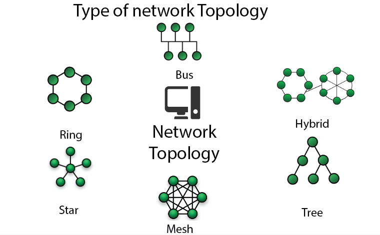
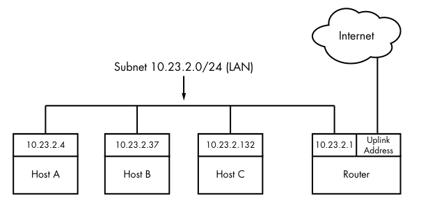

# Información del tema

## Tiempo estimado

Aproximadamente 180 minutos de clase.

## Objetivos

El objetivo general es que los alumnos sean capaces de entender la red en la que
trabajan así como sun configuración básica. Además, aprenderá a habilitar y
configurar un *firewall* para regular el tránsito de paquetes entrante y
saliente de la máquina que administran.

# Redes de computadoras

Se trata de un conjunto de computadoras que están conectadas entre sí por medio
de algún medio y que comparten recursos entre sí.

¿Cómo se comparten los recursos?

# Topologías de Red



# Hots

A cada una de las computadoras dentro de una red se les llama *host*. En una red
local típica, uno de los hosts de una red local es el *router*, que se encarga
de conectar la red local de computadoras con una red más grande (internet).

# Una LAN típica




# Paquetes

Los datos que transfiere una computadora en la red se envían a través de
paquetes. Un paquete contiene un *header* y *payload*. El primero indica cosas
como el destino y origen del paquete. El *payload* contiene la información como
tal.

Cualquier host puede recibir y enviar paquetes en el orden que sea, sin importar
de donde vengan o vayan.

# *Layers*

Una red incluye distintas capas que conforman un *stack*. Toda red funcional
tiene un *stack*:

- *Applicacion layer*: Protocolos de las aplicaciones que se conectan (HTTP).
- *Transport layer*: Define características de la transmisión de datos. (TCP,
  UDP).
- *Network layer*: Define la ruta de movimiento de los paquetes. (IP).
- *Physcal layer*: Referente al hardware y cómo los datos viajan en él
  (Ethernet, WiFi).

Todos los datos viajan en sube y baja completamente por lo menos una vez en el
*stack* para enviar un paquete a través de la red.

# IPv4

En la capa de red está protocolo IP, donde se tiene el concepto de direcciones
IP.

Estas direcciones nos permiten reconocer a cada uno de los hosts dentro de la
red.

Cada host tiene por lo menos una dirección IP, que le permite conectarse a otras
computadoras y saber dónde están. Funciona como una dirección real.

Estas direcciones están compuestas por 4 bytes. Por ejemplo:

10.24.2.57

# Viendo la dirección IP

```sh
ip a
```

# Máscaras de subred


Para restringir las IPs de una red a un ragno específico (rubred), se utiliza el
concepto de máscaras

```
10.23.2.0:      00001010 00010111 00000010 00000000
255.255.255.0:  11111111 11111111 11111111 00000000
```

# Máscaras de red

La los unos en la máscara indican las partes de la dirección que no pueden
cambiar.

`255.255.255.0` hace que sólo puedan cambiar los bits del último octecto:

```
10.23.2.0-255
```

# Notación CIDR

| Notación larga | Notación CIDR |
|---|---|
|`255.0.0.0`| `/8` |
|`255.240.0.0`| `/12` |
|`255.255.0.0`| `/16` |
|`255.255.255.0`| `/24` |
|`255.255.255.192`| `/26` |

# Rutas

Para que una computadora se conecte con otras en el internet, debe hacerlo a
través de un *router*. 

```sh
ip route show
```

Se indica al *router* con el que se hace contacto con el internet con la palabra
`default`

# El comando `ping`

Este comando verifica la conexión entre dos *hosts*, enviando un mensaje de ida
(*ping*) y esperando otro de regreso (*pong*):

```
$ ping 8.8.8.8
PING 8.8.8.8 (8.8.8.8) 56(84) bytes of data.
64 bytes from 8.8.8.8: icmp_seq=1 ttl=117 time=9.10 ms
64 bytes from 8.8.8.8: icmp_seq=2 ttl=117 time=8.90 ms
64 bytes from 8.8.8.8: icmp_seq=3 ttl=117 time=9.26 ms
64 bytes from 8.8.8.8: icmp_seq=4 ttl=117 time=8.91 ms
```

# DNS

*Domain Name System* es la manera en la que un *host* puede comunicarse con otro
sin saber su dirección IP de manera directa, sino mediante su nombre (`unam.mx`,
`google.com`, ...)

# DNS

Uns *host* cliente le pide hace peticiones al servidor DNS para poder así
conocer todas las IPs correspondientes a los *hostnames*.

# DNS

Puedes conocer la dirección IP correspondiente a un dominio con el comando
`host`:

```
$ host unam.mx
host unam.mx                                                                
unam.mx has address 132.248.166.17
```

# `/etc/hosts`

Este archivo sobreescribe las búsquedas de nombres de *hosts*, ignorando el DNS
para ellos.

# `/etc/revolv.con`

Este archivo contiene las direcciones de los servidores DNS con los que el
sistema se comunicará.

# TCP

La ventaja principal de TCP es que se asegura de la integridad de los datos
enviados a pesar de que se desordenen en el camino.

No necesitan implementación específica en los programas. La aplicación sólo
necesita saber cómo iniciar una nueva conexión.

La capacidad de integridad de TCP lo hace más lento que UDP.

# TCP

Este protocolo permite realizar conexiones a través de *puertos*.

Se identifican con números y sirven para serparar mensajes un servicio de otro.


# TCP

Al iniciar una conexión, se utiliza un puerto tanto en un *host* como en el
otro. 

Un cliente generalmente abre un puerto aleatorio[^1] mientras que el servidor
tiene algún puerto preestablecido para el servicio correspondiente desde el cuál
escuchar nuevas conexiones (como 80, para servidores web).

[^1]: Puerto efímero.

# TCP

Con `netstat`, puedes ver las conexiones TCP realizadas en este momento:

```
$ netstat -nt
```

# Puertos TCP comúnes

|Servicio, protocolo| Número de puerto|
|---|---|
|FTP|`20,21`|
|SSH|`22`|
|Telnet|`23`|
|SMTP|`25`|
|HTTP|`80`|
|HTTPS|`443`|

# Sabiendo qué está escuchando tu máquina

Para conocer los puertos desde los cuáles un sistema está escuchando, usa

```
netstat -ntl 
```

# UDP

Es más simple que TCP, sólo define una forma de enviar mensajes únicos, pero no
*streams* completos de datos. Ni siquiera cuenta con el concepto de conexiones.

Es necesario que la aplicación maneje a su manera la pérdida o desordenamiento
de datos de los que TCP de encarga automáticamente.

Se utiliza UDP cuando se necesita velocidad por sobre integridad de datos, como
en la transimisión de videos en un sistema de streaming.

# DHCP

DHCP es un protocolo para configurar automáticamente a los *hosts* de una red.

Se le asigna una dirección IP y un router de salida (*gateway*) al nuevo *host*
sin intervención manual.

Todas las redes domésticas tienen un servidos DHCP (generalmente dentro del
*router*).

# Firewalls

Es *hardware* o *software* que se encarga de monitorear y bloquear tráfico
indeseado a través de una red.

Todo *router* debe incluir uno para mantener fuera cualquier tráfico que pueda
ser dañino para la red.

# Firewalls

Un firewall filtra los paquetes al momento de recibirlos o enviarlos. Un paquete
puede ser filtrado (bloqueado) dependiendo de varios criterios:

- IP de origen o destino
- Puerto de origen o destino
- La interfaz por la cuál pasa el paquete.

# Firewalls

Si bien todo *router* incluye un *firewall*, también el resto de *hosts* pueden
llevar uno para filtar los paquetes de manera más granular, sin dependencia
completa en la correcta configuración del *router*.

# Estrategias de configuración del Firewall

Se hablará en este caso de una sóla máquina, no una red entera:

- Generalmente, se bloquean todos los paquetes de entrada, excepto por aquellos
  que correspondan con servicios que la computadora sí esté usando (como SSH).
- También se suelen permitir todos los paquetes de salida, para que la
  computadora pueda conectarse a internet sin problemas.

# Configurando un Firewall

Hay muchas formas de creaer y configurar las reglas de un firewall, en este caso
se utiliza `Firewalld`.

```sh
sudo apt install firewalld
```

`Firewalld` basa su configuración en zonas, se cuentan con distintas reglas
dependiendo de la zona a la que se sea asignado un paquete.

# Zonas de `Firewalld`

Ve las zonas con

```sh
firewall-cmd --get-zones
```

Y ve los servicios asociados con una zona:

```sh
firewall-cmd --list-all --zone=[zona]
```

# Permitir y denegar servicios

Por defecto, `Firewalld` bloquea todos los paquetes de entrada. Esto puede
cambiarse:  

```sh
sudo firewall-cmd --zone=external --add-service=ftp
```

Este comando agrega al servicio FTP a la zona *external*, permitiendo conexiones
desde el exterior al puerto correspondiente.

# Permitir y denegar servicios

También puede hacerse la configuración a partir del puerto específico o del
protocolo:

```sh
sudo firewall-cmd --permanent  \
    --zone=external --add-port=60001/udp
```
El comando permite conexiones externas entrantes al puerto 60001 utilizando el
protocolo UDP.
