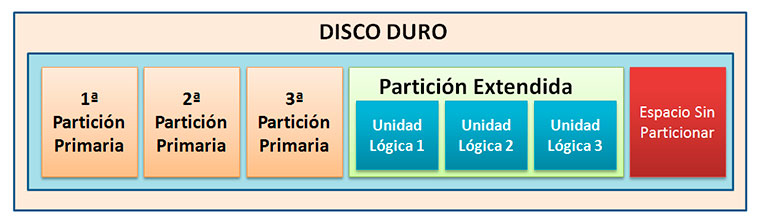
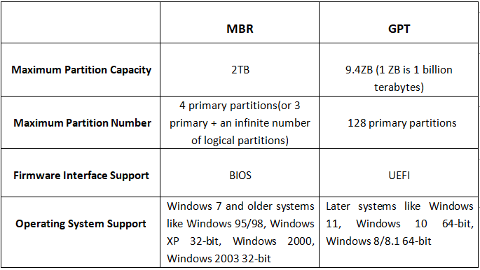
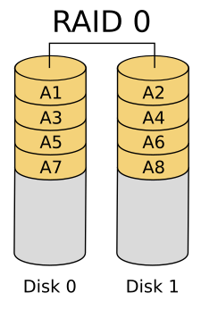
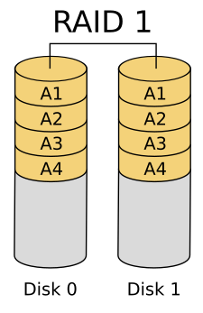
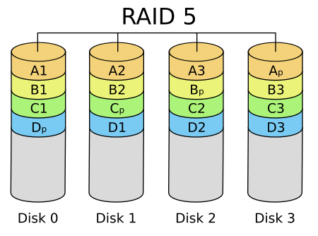
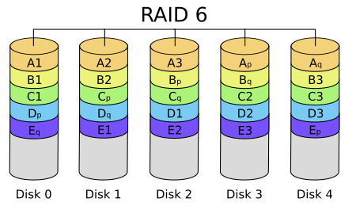

# Información del tema

## Tiempo estimado

Aproximadamente 120 minutos de clase.

## Objetivos

Que el alumno entienda conceptos y propiedades de:

- Particiones, tipos de tabla y tipos de arranque
- Sistemas de archivos, características
- Montado de sistemas y sus propiedades
- RAID

# Particiones

La partición de discos es el proceso de dividir un disco en una o más áreas lógicas que **pueden se tratadas individualmente**.

La información de las particiones se guarda en un espacio en disco llamado tabla de particiones.



# Particiones

## Tipo de arranque



# Particiones

## Comandos

### Listar dispositivos de bloques

```sh
lsblk
# o
fdisk -l
```

### Editar particiones de disco

```sh
fdisk /dev/disk
```

- `m` : Ayuda
- `p` : Imprimir tabla de particiones
- `w` : Escribir cambios

# Sistema de archivos

Es una estructura compuesta por 3 capas.

- Lógica: Es la interfaz en que las aplicaciones interactúan con los archivos
- Virtual: Forma de interactuar con los medios físicos con una interfaz estandarizada
- Física: Responsable de administrar los bloques de memoria, acceso y almacenamiento.

## Formato de dispositivo

```sh
mkfs.fs /dev/disk
```

# Sistema de archivos

## Características

### Administración de espacio

Como se almacenan los bloques de memoria y fragmentación.

### Nombres de archivo

Pueden contener limitaciones como el uso de ciertos caracteres, tamaño de nombre o sensibilidad a mayúsculas y minúsculas

### Directorios

La forma de almacenar la jerarquía de los archivos manteniendo un índice de cada uno

### Metadata

Información extra de cada archivo como tamaño, permisos, tipo, fechas de acceso, etc

# Sistema de archivos

## Características

### Utilidades

Funciones exclusivas de cada sistema para administrar, respaldar, recuperar, etc.

### Diseño

Depende como el sistema fuera diseñado puede contar con limitaciones.

# Sistemas de archivos

### Journaling

Se almacena una bitácora con los cambios realizados en los archivos que aún no se almacenan en disco. En caso de que exista un error se pueden realizar esos cambios.

### Versioning

Se almacenan distintas versiones de un mismo archivo, sirve de forma de respaldo

### Copy On Write (COW)

Se almacenan multiples copias cada vez que se realiza una modificación.

### Inodo

El indice de un nodo es la representación de un archivo o directorio con sus respectivos parámetros.

# Sistemas de archivos

## ext4

Desarrollada en 2006. Cuarta versión de el formato ext.

- Pre-asignación persistente
- Número ilimitado de directorios
- Checksum de metadata
- Archivos grandes
- Gran compatibilidad

# Sistemas de archivos

## xfs

Sistema de 64 bits con journaling creado en 2001. Usa el paquete `xfsprogs`

- Snapshots por COW
- Defragmentación online
- Tamaño de bloques variables
- Su fuerte es el paralelado de operaciones I/O.

# Sistemas de archivos

## btrfs

Desarrollado en 2007. Usa el paquete `btrfs-progs`

- Snapshots
- Agrupación de discos
- Depuración de datos
- Auto-reparación
- Defragmentación online
- Compresión online

# Montado de sistema

El proceso de montado es en el cual a un dispositivo de bloques que cuenta con un formato de sistema de archivos se le asigna un punto de montado en `/`.

La herramienta para administrar este tipo de montados es `mount`

```sh
mount -t tipo -o opciones /dev/disk /path/target
```

# Montado de sistema

## Permanente

Se encuentra en `/etc/fstab`. Actualmente la configuración la realiza systemd por lo que para guardar cambios es necesario un `systemctl daemon-reload`

```fstab
# <file system>        <dir>         <type>    <options>             <dump> <pass>
/dev/sda1              /             ext4      defaults              1      1
/dev/hdxx              /usr          ext4      defaults              1      1
/dev/sda5              swap          swap      defaults              0      0
```

# Montado de sistema

## Opciones

La mayoría de las opciones tienen una negación con el prefijo no

- auto - file system will mount automatically at boot, or when the command 'mount -a' is issued.
- exec - allow the execution binaries that are on that partition (default).
- ro - mount the filesystem read only.
- rw - mount the filesystem read-write.
- sync - I/O should be done synchronously.
- flush - specific option for FAT to flush data more often, thus making copy dialogs or progress bars to stays up until things are on the disk.

# Montado de sistema

- user - permit any user to mount the filesystem (implies noexec,nosuid,nodev unless overridden).
- defaults - default mount settings (equivalent to rw,suid,dev,exec,auto,nouser,async).
- suid - allow the operation of suid, and sgid bits. They are mostly used to allow users on a computer system to execute binary executables with temporarily elevated privileges in order to perform a specific task.
- noatime - do not update inode access times on the filesystem. Can help performance.

# RAID

Matriz Redundante de Discos Independientes. Es utilizado para construir sistemas con redundancia, es decir, duplicación de funciones críticas de tal forma que el sistema pueda soportar cierta cantidad de caídas sin dejar sin funcionamiento al completo.

Llega a dar mas rendimiento pues las operaciones I/O se realizan en varios dispositivos a la vez.

# RAID



# RAID



# RAID



# RAID



# Actividad

1. Ubica el disco extra en tu sistema
2. Crea una tabla de particiones del estilo mbr en el disco
3. Crea dos particiones en el disco
4. Formatea de dos diferentes sistemas de archivos las particiones
5. Monta los dos sistemas en subdirectorios ubicados en `/mnt`
6. Guarda la configuración en fstab
