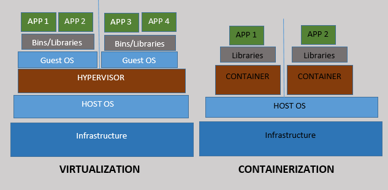
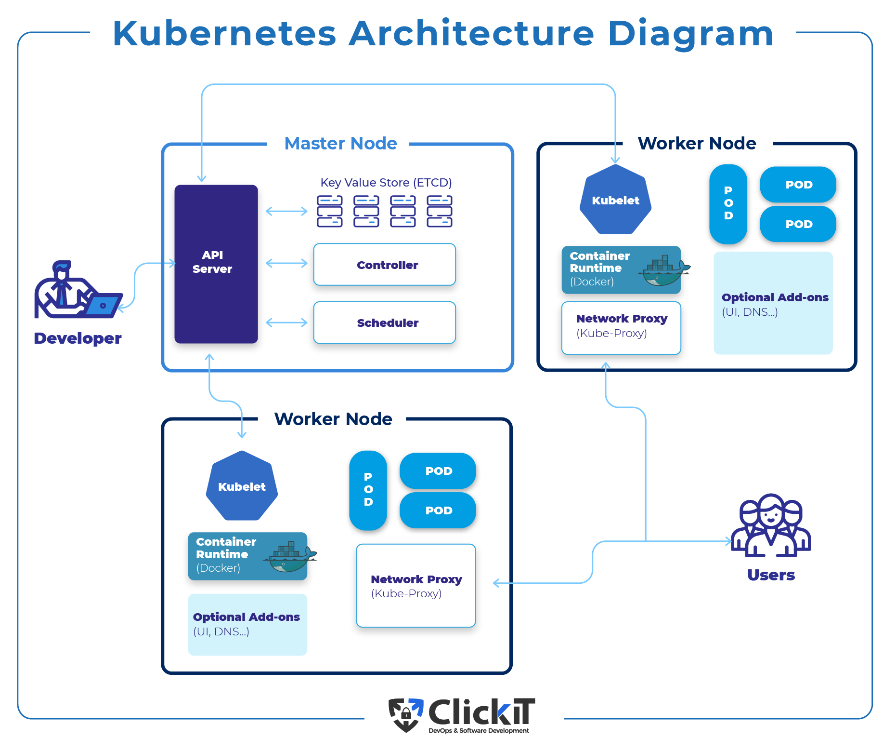

# Información del tema

## Tiempo estimado

Aproximadamente 120 minutos de clase.

## Objetivos

Que el alumno entienda:

- Que es un contenedor y su utilidad
- Comandos de administración de contenedores
- Uso de Containerfile
- Conceptos de Kubernetes

# Introducción al tema

La contenedorización es una especie de virtualización que crea unidades virtuales en el espacio de usuario conocidas como contenedores.

Un contenedor comparte el kernel del host pero se encuentra aislado del resto del sistema mediante el uso de `namespaces` privados y mecanismos de control propios del sistema.

Provee un nivel de abstracción diferente al de maquinas virtuales con la ventaja de un menor uso de recursos a cambio de un mejor aislamiento.

# Introducción al tema

Los contenedores pueden correr virtualmente donde sea, maquinas virtuales o reales, en el nivel desarrollo o en producción.

Para un solo equipo se suelen usar herramientas como lxc para contenedores de sistemas operativos completos o docker/podman para contenedores de aplicación. Con clusters de computadoras la herramienta mas popular es Kubernetes.

# Introducción al tema

Las ventajas son:

- Portabilidad
- Reproducibilidad
- Eficiencia
- Escalabilidad

# Estructura de contenedores



# Docker

La herramienta para utilizar contenedores mas popular pero no la única. Se compone de:

- Docker engine
- Docker image
- Docker registry
- Docker file

# Instalación de docker

Se deben seguir los pasos oficiales. El script es solamente recomendado para entornos de prueba.

```sh
curl -fsSL https://get.docker.com -o get-docker.sh
sudo sh get-docker.sh
```

Para probar la instalación

```sh
docker run hello-world
```

# Conteinerfile

Es el archivo utilizado para la creación de imágenes de contenedores. La creación se realiza por capas siendo cada instrucción una capa con cierta metadata.

```dockerfile
FROM openjdk:11-jdk
ENV apparea /data/app
RUN mkdir -p $apparea
ADD https://get.jenkins.io/war/2.397/jenkins.war $apparea
WORKDIR $apparea
EXPOSE 8080
CMD ["java","-jar","jenkins.war"]
```

# Imagen

Compuesta por multiples capas, es el conjunto de instrucciones usado para crear contenedores. Contiene información de como debe inicializarse ademas de todo lo necesario para correr una aplicación

# Contenedor

Es la instancia de una imagen en tiempo de ejecución. Los directorios no montados en el host son temporales.

# Registro

Similar a un repositorio donde se almacenan imágenes creadas por los usuarios y mantenidas por los desarrolladores oficiales de ciertas distribuciones.

# Comandos

- `run` : Ejecuta contenedores especificando parámetros de inicio
- `pull` : Descarga de imágenes de un registro
- `ps` : Imprime información de los contenedores corriendo
- `start` : Inicia un contenedor previamente creado
- `stop` : Detiene un contenedor, apagando los servicios dentro

# Actividad

## Crea un script the bash

`vim script.sh`

```sh
#!/bin/bash
echo "Hola mundo"
```

## Crea un Containerfile

`vim Containerfile`

```dockerfile
FROM debian:latest
COPY script.sh /
CMD ["bash", "/script.sh"]
```

# Actividad

## Construye la imagen

```sh
sudo docker build -t test .
```

## Corre la imagen

```sh
sudo docker run test
```

# Servicios web con contenedores

Actualmente los contenedores se utilizan para desplegar aplicaciones en su mayoría web. Un ejemplo es:

```sh
docker run -d -p 8080:80 nginx
```

Prueba el acceso

```sh
curl localhost:8080
```

# Opciones a destacar

## Montado de directorios

```sh
docker run -v /path/host:/path/contenedor image
```

## Mapeando puertos

```sh
docker run -p <ip>:<host>:<contenedor> image
```

## Variable de entorno

```sh
docker run -e VARIABLE=valor image
```

## Correr en background

```sh
docker run -d image
```

# Kubernetes


