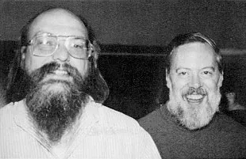
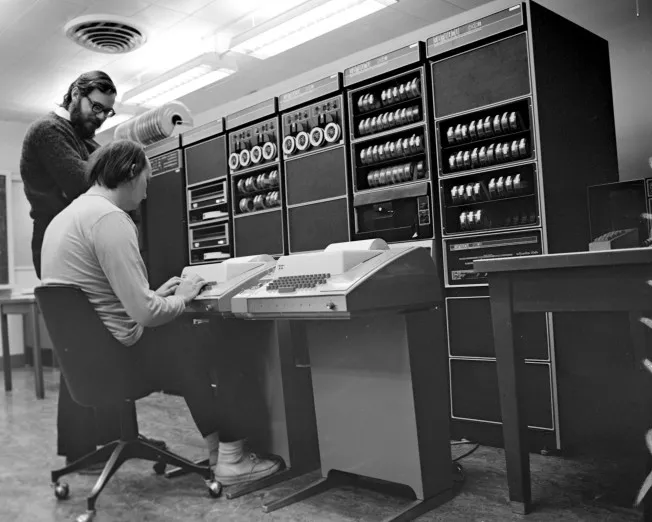
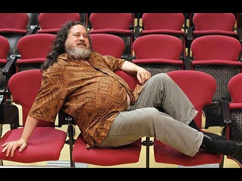

# Información del tema

## Tiempo estimado

Aproximadamente 30 minutos de clase, con participación de los alumnos para
compartir su opinión y dudas respecto al tema.

## Objetivos

- Familiarizarse con la idea del Software Libre, lo que representa y su historia.

- Conocer, de manera resumida, la historia de Linux.

# Tiempos de UNIX

En 1969, el sistema operativo UNIX fue creado por Ken Thompson y Dennis Ritchie,
que trabajaban para AT&T en *Bell Labs*

Este sistema operativo, junto a la filosofía de desarrollo que lo acompañaba,
revolucionaron el mundo de la computación.

# Thompson y Ritchie

{height=2in}

# Thompson y Ritchie

{height=2in}

# Movimiento de Software Libre

Fue iniciado por Richard Stallman (RMS) en 1983, cuando inició el proyecto GNU
(GNU's Not Unix).

En 1985. RMS creó la Fundación del Software Libre, que tiene la misión de avogar
y compartir información sofre el Software Libre.

# RMS 

{height=2in}

# Las cuatro libertades

- Libertad de utilizar el programa como se desee, para cualquier propósito
  (libertad 0).

- Libertad de estudiar el funcionamiento del programa y modificarlo para que
  este haga lo que el usuario desee (libertar 1).

- Libertad de redistribuir copias del software para ayudar a los demás (libertad
  2).

- Libertad de distribuir copias de versiones modificadas del software (libertad
  3).

# Berkeley vs AT&T

La Universidad de California en Berkeley tenía una licencia para el código de
UNIX proveída por AT&T, gracias a la cuál se hizo mucha investigación
relacionada con sistemas operativos.

Esta investigación se incorporó al sistema para dar lugar a la Berlekey Software
Distribution (BSD).

# Berkeley vs AT&T

Para liberarse de las restricciones impuestas por la licencia de AT&T,
estudiantes de Berkeley empezaron a eliminar el código original y reemplazarlo
con código nuevo, bajo una licencia libre.

# Berkeley vs AT&T

Cuando se realizó el *port* de BSD hacia procesadores i386, que se creía que ya
no contenía propiedad intelectual de AT&T, esta última inició un proceso legal
para detenerlos que duró entre 1992 y 1994.

# La pieza faltante de GNU

El proyecto de RMS consiguió crear muchas de las partes necesarias para
conformar un sistema operativo en toda regla, como una shell y las *coreutils*.

Todavía había algo que faltaba, un pequeño detalle, casi insignificante. Faltaba
un kernel para GNU.

# Linux

Linus Torvalds, un estudiante de Ciencias de la Computación finlandés, empezó un
proyecto de crear un kernel debido a su descontento con el kernel del sistema
Minix (creado por Andrew Tanenbaum).

Lo hizo él porque el kernel de GNU (Hurd) no estaba listo todavía.

# GNU / Linux

Dado que Torvalds había creado un kernel  compatible con las partes que GNU ya
había creado, se incorporó el kernel de Linux al sitema GNU dando lugar al
sistema que ahora llamamos GNU / Linux.

Gracias al problema legal de BSD, GNU / Linux se volvió la única opción de
sistema operativo libre, lo que impulsó su popularidad.

# GNU / Linux

Prácticamente todas las distribuciones de Linux (pronto hablaremos de eso) son
un sistema GNU / Linux.

# Distribuciones de Linux

Dada la naturaleza libre de GNU / Linux, varios grupos de personas empaquetan
programas y configuraciones extra para así distribuir un sistema operativo
completamente funcional.

Estos sistemas ya preparados son conocidos como distribuciones (Distros).

# Diferencias entre distribuciones

En general, lo que separa a una distribución de otra es:

- La gente que está detrás
- La manera en la que se instala software en el sistema
- Las configuraciones predeterminadas
- La agenda de lanzamientos de nuevas versiones

Por lo demás, un sistema Linux es un sistema Linux.
