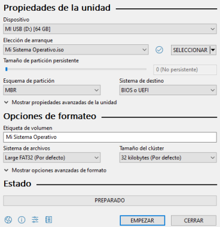
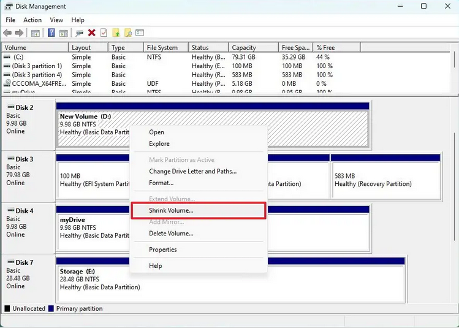

# Información del tema

## Tiempo estimado

Aproximadamente 1:30 horas de clase, donde los alumnos seguirán las
instrucciones dadas para poder insalar el sistema operativo.

## Objetivos

- Al finalizar esta clase, o antes de empezar la otra, el alumno contará con una
  instalación de Linux utilizable en su computadora.

# Distribución a instalar

Para esta clase, se instalará Fedora Linux, pues es la distribución con la que
se tiene más experiencia en este laboratorio.

Realmente cualquier distribución de su preferencia funcionará, así que si deseas
usar otra, puedes hacerlo. También puedes pedirnos ayuda con esa instalación.

# ¿Hiciste tu respaldo?

No es común que se pierdan datos al instalar un nuevo sistema operativo en tu
computadora, pero cometer algún error puede derivar en la pérdida de información
en el disco duro.

¡Respalda todos los archivos que te importen!

# Crea tu medio de arranque

Descarguemos una ISO de Linux y utilicemos un programa como *Rufus*[^1] para
cargarla en una memoria USB.

[^1]: https://rufus.ie/es/

{height=1.5in}

# Libera espacio en el disco

Ve a `Create and format hard disk partitions` y click derecho a la partición que
quieras achicar. Deja alrededor de 120 GB para no sufrir por espacio, aunque
pueden ser menos.

{height=2in}

