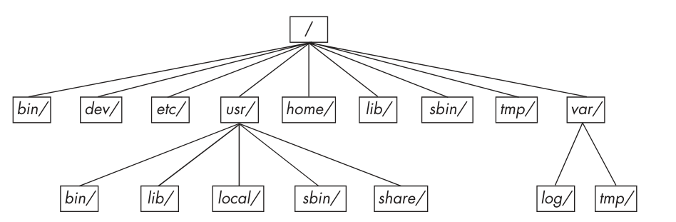

# Información del tema

## Tiempo estimado

Aproximadamente 1 hora de clase, repartido en secciones de explicación teórica y
pequeños ejercicios para reforzar el aprendizaje.

## Objetivos

- Conocer la organización canónica de los directorios en un sistema de archivos
  tipo UNIX.

- Que los alumnos estén acostumbrados al paradigma de UNIX donde todo es un
  archivo.

# Lo más básico de la terminal

Abre tu programa de terminal. Ahí verás el prompt: la línea que termina con un
`$`.

```
[usuario@hostname ~] $ 
```


# Lo más básico de la terminal

Una vez aparecido el prompt, puedes escribir comandos. Un comando es un
programa que hace algo en el sistema. Este programa puede ser de cualquier tipo.

Ejemplo: utiliza el comando `date`:

```sh
$ date
```

```
Thur Sep  5 01:05:16 PM CST 2024
```


# Lo más básico de la terminal

Presiona Enter y no escribas el $, este último sólo indica al usuario que
puede escribir un nuevo comando y se utilizará para indicar que cierta línea de
código se trata de un comando.

# Archivos

Un archivo en Linux es la manera en la que el sistema operativo almacena datos.

Un archivo físico tiene un nombre, contenidos, un lugar en el que se almacena,
así com ouna serie de datos administrativos sobre quién es su dueño y su tamaño.
En el sistema operativo estos atributos también existen.

# Archivos

En un archivo tu puedes guardar la secuencia de bits que a tí se te antoje,
puedes guardar el texto de una carta, de un reporte, código fuente de algún
programa, o una imagen.

# Comandos muy comúnes para trabajar con archivos

Empecemos por un editor de texto

Gracias a un editor de texto puedes... editar texto.

Utilizaremos `nano`, pues está hecho para ser fácil de usar.

```sh
$ nano nombre-de-un-archivo
```

# Comandos muy comúnes para trabajar con archivos

Una vez abierto `nano`, puedes escribir tu texto directamente. Tambiénuedes
mover tu cursor con las flechas direccionales

Para guardar tus cambios, presiona `Ctrl+O` (`^O`). Escoge el nombre con el que
se guadrará y sal con `^X`.

# Pequeña actividad

Utiliza `nano` para crear y llenar tres archivos de texto:

- `chiste`: Un chiste.
- `basura`: Cualquier cosa que quieras.
- `tareas`: Una lista de tareas que tengas que hacer.

# Comandos muy comúnes para trabajar con archivos

Puedes ver una lista con los nombres de los archivos de cierto lugar con `ls`:

```sh
$ ls
```

```
basura  chiste  tareas
```

Puede que haya más archivos que ya existían desde antes.

# Comandos muy comúnes para trabajar con archivos

Muchos comandos, como `ls`, tienen opciones que modifican su comportamiento por
defecto.

Las opciones se escriben después del nombre del programa a ejecutar y
generalmente llevan un `-` por delante.

¿Qué hace el siguiente comando?

```
ls -l
```

# Comandos muy comúnes para trabajar con archivos

Generalmente, puedes pasarle muchas opciones a un mismo comando, aunque depende
ya de cada programa:

```sh
$ ls -l -a
```

Que es lo mismo que:

```sh
$ ls -la
```

# Comandos muy comúnes para trabajar con archivos

A veces no es tan conveniente usar un editor para ver los contenidos de
unarchivo, especialmente si no vas a editar nada.

Puedes mostrar los contenidos de un archivo con el comando `cat`:

```sh
$ cat tareas
```

```
Estudiar para el examen de Bases de Datos
Comprar 1 kilo de huevo
Blah
Hlab
```

# Moviendo, borrando, copiando archivos

Puedes mover un archivo de un lugar a otro con `mv`. Este comando también se
puede utilizar para "renombrar" un archivo:

```sh
$ mv basura tesoro
```

# Moviendo, borrando, copiando archivos

Para copiar un archivo se utiliza el comando `cp`. Todos los contenidos de un
archivo se copian al otro

```sh
$ cp tesoro tesoro-respaldo
```

# Moviendo, borrando, copiando archivos

Si quieres borrar un archivo, se utiliza el comando `rm`:

```
$ rm tesoro
$ ls
```

```
chiste  tareas  tesoro-respaldo
```

# Pequeña actividad

A partir de los archivos creados en la actividad anterior, cambia sus nombres de
manera que:

- El archivo `chiste` tenga los contenidos que antes tenía `tareas`
- El archivo `tareas` tenga los contenidos que antes tenía `basura`
- El archivo `basura` tenga los contenidos que antes tenía `chiste`

Y que al final sólo estén esos archivos (además de los que ya existían desde el
principio de la clase).


# Comandos muy comúnes para trabajar con archivos

Generalmente, los comandos en Linux son *silenciosos*, es decir, no envían
información de salida si todo sale bien.

En muchos casos, cuando sale información en pantalla es porque son errores:

```sh
$ rm archivo-inexistente
```

```
rm: cannot remove 'archivo-inexistente': No such file 
or directory
```

# Otros comandos

Para saber cómo se utiliza un comando, siempre es buena idea utilizar el comando
`man` para ver un pequeño manual sobre el uso del comando:

```sh
$ man ls
```

# Otros comandos

Si quieres conocer la cantidad de líneas, palabras o caracteres en un archivo,
utiliza `wc`:

```
wc tareas
```

Con las opciones `-l`, `-c`, `-w`, puedes elegir qué contar.

# Otros comandos

Un comando muy utilizado para el procesamiento simple de texto es `grep`. Es un
programa que busca un patrón en las líneas de un archivo de texto.

El nombre viene de un comando del antiguo editor `ed`: `g/regular-expression/p`.

# Otros comandos

Supongamos que tenemos este archivo de texto:

```sh
$ cat quijote
```

```
En un lugar de La Mancha, de cuyo nombre no quiero acordarme,
no ha mucho tiempo que vivía un hidalgo de los de lanza y adaga,
adarga antigua, rocín flaco y galgo corredor.
```

Puedo buscar la palabra "*un*" con

```
$ grep un quijote
```

# Otros comandos

`sort` es un comando que, como su nombre lo indica, ordena los contenidos de un
archivo e imprime el resultado:

```sh
cat arhivo
```

```
c
f
o
q
a
```

```sh
sort arhivo
```


```
a
c
f
o
q
```

# Otros comandos

`sort` tiene algunas opciones muy útiles cuando se quiere ordenar un archivo por
un criterio distinto al lexicográfico:


| Comando | Significado |
|---|---|
| `sort -r` | Ordena en orden inverso |
| `sort -n` | Ordena en orden numérico |
| `sort -n` | Ordena en orden numérico |
| `sort -h` | Ordena tamaños (99 K antes de 1 G) |

# Otros comandos

Los comandos `head` y `tail` son útiles para mostrar sólo la primera o la última
parte de un archivo, respectivamente:

```
cat archivo-largo
Elit aliquid quas ipsa 
facere 
facilis sequi 
similique? 
Laboriosam 
iusto ipsam
...
```

```sh
$ head -n 3 archivo-largo

```
```
Elit aliquid quas ipsa 
facere 
facilis sequi 
```

# Directorios

En el sistema puede haber muchos archivos con el nombre `tareas`, pero no en el
mismo lugar.

La manera en la que el S.O. puede distinguir cada uno de los
archivos llamados `tareas` es mediante la grupación de archivos dentro de
*directorios* (carpetas, folders, ...) y *subdirectorios* (un directorio dentro
de otro).

# Directorios

Todos los archivos del sistema operativo tienen una organización lógica con la
forma de un árbol.

Cada nodo de el árbol es un archivo que, en caso de ser un directorio, puede
a su vez ser la raíz de otro árbol.

A la raíz del árbol entero se le conoce como el directorio raíz (`/`).

# La jerarquía de directorios




# Directorios

Cada usuario real del sistema tiene un directorio personal (casi siempre dentro
del directorio `/home`), que contiene todos sus archivos.

Cuando inicias una sesión en la shell (cuando abres la terminal), empiezas
trabajando dentro de tu directorio personal.

# Directorios

Puedes cambiar el directorio en el que trabajas (*working directory*) con el
comando `cd` (`pwd` es un comando que muestra tu *working directory*)

```sh
$ pwd
```

```
/home/paco
```

```sh
$ cd Downloads
```

```
/home/paco/Downloads
```

# Directorios

De esta manera, puedes guardar archivos con el mismo nombre pero dentro de
diferentes directorios para que no haya conflictos.

# Directorios

Crea un nuevo directorio con el comando `mkdir`

```
$ mkdir nuevo-dir
```

# Directorios

A pesar de que los directorios son archivos, para eliminar un directorio con contenidos, no puedes utilizar el comando `rm` así nada más. Necesitas hacer un eliminado recursivo:

```
rm -r nuevo-dir
```

# Rutas

Una *ruta* es una manera de identificar cierta parte del árbol de archivos del
sistema operativo. Una ruta consiste de una serie de nombres de directorios
separados por diagonales (`/`) para indicar el recorrido que se debe hacer para
llegar de un punto a otro.

# Rutas abolutas

Una ruta absoluta inicia desde el directorio raíz (`/`) y describe el camino
completo para llegar a cierto sitio:

```
/home/paco/Pictures/vacaciones/museo.png
```

Las rutas relativas siempre empiezan con una `/` (el directorio raíz)

# Rutas relativas

En una ruta relativa se inicia desde el directorio de trabajo actual (puedes
verlo con `pwd`) y describen cómo llegar a cierto sitio *desde* el *working
directory*. Por ejemplo, si se trabaja desde la carpeta personal de un usuario:

```
/home/paco/
```

Escribir la ruta `Pictures/vacaciones/museo.png` es una ruta relativa equivalente a la ruta
absoluta `/home/paco/Pictures/vacaciones/museo.png`

# Rutas relativas

Existen algunos elementos de utilidad en las rutas relativas:

-`.`: Hace referencia al directorio actual
-`..`: Para ir al directorio padre

```
./Downloads
```

```
../../bin
```

# La jerarquía de directorios


# La jerarquía de directorios

Aquí hay algunos de los *subdirectorios* más importantes dentro de la raíz.

- `/run` Contiene datos de tiempo de ejecución, archivos de socket, algunas
  bitácoras.
- `/sys` Similar a `/proc`, provee interfaces para dispositivos y el sistema.
- `/sbin` Lugar para ejecutables del sistemas, son binarios que se suelen solo
  utilizar mediante el usuario root.

# La jerarquía de directorios

- `/tmp` Suele ser pequeño, contiene archivos temporales, todos tienen acceso a
  este directorio. No debe tener archivos importantes pues el sistema suele
  limpiarlo constantemente.
- `/usr` Contiene una copia similar a `/`, con subdirectorios como `/usr/bin`,
  `/usr/lib` y este tipo de archivos. Se mantiene separado históricamente para
  mantener `/` chico.
- `/var` Contiene datos variables a lo largo del tiempo de los programas, cosas
  como bitácoras, cache, etc.

# Otros subdirectorios

- `/boot` Contiene los archivos del kernel y lo relacionado con el arranque.
- `/media` Un punto de montado de dispositivos que se pueden remover como
  memorias usb o sd.
- `/opt` Contiene software de terceros

