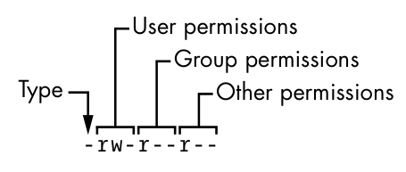

# Información del tema

## Tiempo estimado

Aproximadamente 1 hora de clase, repartido en secciones de explicación teórica y
pequeños ejercicios para reforzar el aprendizaje.

## Objetivos

- Aprender la utilidad de la existencia de usuarios, grupos y permisos en un
  sistema Linux
- Aprender a crear, modificar y eliminar usuarios y grupos del sistema.
- Se podrán interpretar y asignar diferentes permisos a los archivos del sistema
  de archivos.

# Usuarios

Linux se trae consigo la noción de UNIX sobre *usuarios*. Un usuario es una
entidad que puede ejecutar procesos y ser dueño de archivos. Se identifican
mediante su `UID`.

Comúnmente se crea un usuario para cada persona que utilice la computadora
(*normal user*).

Ciertos programas también crean sus propios usuarios para realizar sus tareas
(*system user*).

# Usuarios

La creación de usuarios permite configurar los permisos de los archivos de
manera que sólo ciertos usuarios puedan hacer ciertas cosas, dependiendo de la
jerarquía o reglas que se quieran implementar.

# Usuarios

Puedes ver el `uid` y los `gid` (relacionado con los grupos) de tu usuario con
el comando `id`:

```
uid=1000(paco) gid=100(users) groups=100(users),1(wheel),...
```

# El usuario root

El usuario más importante del sistema es `root`. Este es el usuario con mayores
privilegios. También se le conoce como administrador o *superuser*.

## Advertencia

El usuario `root` puede hacer todo, incluso aquellas operaciones que atentan
contra la integridad del sistema. ¡Ten cuidado al momento de ejecutar comandos
como `root`!

# Creando usuarios

Comando `useradd`

# Eliminando usuario

Comando `userdel`. Este comando también puede elimidar el directorio personal
del usuario

# Grupos

Un grupo es un conjunto de usuario. El propósito de los grupos, pues, agrupar
muchos usuarios así como los permisos que ellos tienen.

Cada grupo se identifica con un `id`

# Grupos

Cada usuario tiene un grupo principal (`gid`). El `gid` se hereda hacia los
archivos que crea el usuario, cosa a tener en cuenta al momento de asignar
archivos.

# Creando grupos

Comando `groupadd`

# Eliminando grupos

Comando `groupdel`

# Agregando usuarios a grupos

Comando `usermod -aG nombre-grupo nombre-usuario`

# Permisos

En general, un usuario puede realizar tres operaciones básicas con un archivo:

- Lectura (`r`)
- Escritura (`w`)
- Ejecución (`x`)

# Permisos

Estos permisos de un archivo se asignan para :

- El usuario dueño del archivo
- Los usuarios del grupo dueño del archivo
- Para el resto de usuarios

# Permisos

```
$ ls -l 00-presentacion-curso.md
-rw-r--r-- 1 paco users 1737 Sep  3 07:46 00-presentacion-curso.md
```

{height=1.5in}

# Formas de leer los permisos de un archivo

|Representación| Tipo | Perm. dueño | Perm. grupo | Perm otros |
|---|---|---|---|---|
|Simbólica|`-`|`rw-`|`r--`|`r--`|
|| | `110`|`100`|`100`|
|Octal| | 6|4|4|

# Formas de leer los permisos de un archivo

En su representación octal, los permisos del archivo se dividen en tres grupos
de tres *bits* (octetos). La posición de cada *bit* hace referencia a cada uno
de los permisos.

Cada una de estos octetos se convierte a decimal para describir los
permisos con sólo tres números:

`rw-r--r-- -> 110 100 100 -> 644`

# Haciendo la conversión rápidamente

- El permiso de escritura vale 4
- El permiso de lectura vale 2
- El permiso de ejecución vale 1

# Actividad

# Modificando los permisos de un archivo

El comando `chmod` permite cambiar los permisos de un archivo:

```sh
chmod u+x archivo # El usuario ahora puede ejecutar
chmod g+w archivo # El grupo ahora puede escribir
chmod o+r archivo # El resto ahora puede leer
chmod a+r archivo # Ahora todos puede leer
chmod o-r archivo # El resto ya no puede leer
```

También se puede utilizar la notación octal para definir por completo los
permisos con un solo comando:

```sh
chmod 755 archivo # ¿Qué significa esto?
```

# Cambiando el dueño de un archvo

Se puede cambiar tanto el usuario como grupo dueño de un archivo con el comando
`chown`:

```
$ chown paco:estudiantes tarea.txt
```
