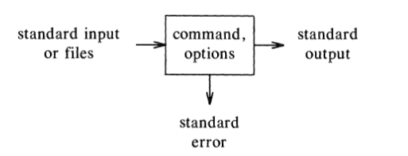

# La *shell*

El programa encargado de interpretar qué programas debe ejecutar a partir de lo
que escribas en la terminal se le llama *shell*. 

Es sólo un programa como cualquier otro. Su objetivo es actuar como un
intermediario entre el *kernel* del sistema operativo y la persona que utiliza
la computadora.

La *shell* por defecto en Debian es `bash`, aunque existen muchas otras, como
`zsh`, `csh`, `tcsh`, `dash`, etc.

# Sintaxis de la ejecución de un comando en la *shell*

Un comando generalmente empieza indicando el nombre de un programa seguido de
distintos *argumentos* que indican comportamiento. Los distintos argumentos se
indican separados por espacios. Los argumentos que modifican el comportamiento
por defecto de un programa suelen empezar con un guión (`-`), a estos se les
suele conocer como banderas. 

Un ejemplo de un comando es el siguiente:

```
$ cat /etc/passwd
```

# Entrada y salida estándar

En otras palabras, cuando escribes datos a un programa a través de la terminal
de un programa, estás escribiendo en su *stream* de **entrada estándar**. Cuando
el programa escribe algo en la terminal, está utilizando su *stream* de **salida
estándar**.

# Entrada y salida estándar



# Redirección de salida

Si listamos los contenidos de la carpeta `home` de un usuario, es
posible que veamos algo como esto:


```
$ ls -l
.  ..  .bash_logout  .bashrc  .config  .lesshst  .profile  .ssh
```

# Redirección de salida

Si se quiere es almacenar estos resultados a largo plazo, o para analizarlos
después, puede hacerse que estos archivos se guarden en un archivo en lugar de
mostrarse en la terminal:

```
$ ls -l >mi-home.txt
$ cat mi-home.txt
.  ..  .bash_logout  .bashrc  .config  .lesshst  .profile  .ssh
```

# Redirección de salida

El archivo al cual se hace referencia al redirigir la salida es creado en el
caso de que no existiera anteriormente. Si el archivo ya existía, **los
contenidos son sobreescritos por completo**. Así que cualquier cosa que
estuviera almacenada en el archivo anteriormente se pierde.

# Redirección de salida

Si no se desea sobreescribir los datos almacenados en el archivo de destino,
puede utilizarse el símbolo `>>`, que opera de manera muy similar a `>`, con la
diferencia de que `>>` agrega los nuevos datos al final de los ya
existentes. Un ejemplo del uso de `>>` es el siguiente: en un principio
concatenas varios archivos utilizando `cat`.


# Redirección de entrada

Con `<` se puede redirigir la entrada. Por ejemplo, si se necesita
ordenar la lista de alumnos de un curso, puede utilizarse el siguiente comando:

```
$ sort <alumnos.txt
Alberto
...
Yael
Zaír
```


# Redirección de entrada

El resultado es el mismo que el que hubiéramos obtenido con el comando `sort
alumnos.txt`. La diferencia aquí es que, cuando no se utiliza
redirección, el programa `sort` se encarga de abrir y leer el archivo
para posteriormente ordenarlo. Cuando uno redirige con `<`, es la *shell* la que
se encarga de abrir y leer el archivo, así que desde la perspectiva de `sort`,
hay una persona escribiendo los nombres uno a uno.

# Redirección de entrada

Esta diferencia tiene la poderosa implicación de que ahora podemos utilizar
archivos como datos de entrada para cualquier programa que lea desde la
terminal, independientemente de que haya sido programado para ello.

# Tuberías (`pipes`)

El concepto de redirección invita la posibilidad de ejecutar un comando, guardar
su salida en un archivo, y luego utilizar ese archivo para alimentar a otro
comando. Este proceso se vuelve tedioso muy rápido, por lo que se creó el
concepto de *pipes*. Una *pipe* es una manera de conectar la salida estándar de
un programa con la entrada estándar de otro. Se le llama *pipeline* a la
conexión de dos o más programas por medio de *pipes*. Algunos ejemplos de pipes
son:

```sh
$ ls | wc -l # Cuenta los archivos
```

```sh
# Muestra top 5 archivos pesados aquí
$ du -sh ./* | sort -rh | head -5
```

# Tuberías (`pipes`)

Los programas dentro de una *pipeline* se ejecutan al mismo tiempo, de manera
concurrente, no secuencialmente como parecería a primera vista. Ejecuta `cat |
grep` para verificarlo.

Lo increíblemente poderoso de las tuberías es que permite la colaboración entre
muchos programas de manera completamente transparente, sin necesidad de que
estos estén programados explícitamente para interactuar entre sí. Los programas
ni siquiera necesitan saber que están dentro de una *pipeline*. A partir de
*pipelines* pueden generarse comportamientos extremadamente complejos con una
serie de programas simples.
