# Información del Curso

## Tiempo estimado

Aproximadamente 60 minutos.

## Objetivos

Que los participantes entiendan:

- Creación de un repositorio en GitHub
- Manejo de ramas
- Flujo de trabajo básico de git

# Introducción al tema
## Qué es Github

Github es una plataforma de desarrollo colaborativo basada en el sistema de control de versiones de git que es ampliamnete utilizada en la comunidad de desarrollo de software, pues nos permite almacenar nuestro código fuente y colaborar en diversos proyectos de software. 

# Un poco de historia

- Github fue fundada en 2008 por Tom Preston-Werner, Chris Wanstrath, PJ Hyett y Scott Chacon. Su objetivo era facilitar la colaboración entre desarrolladores.

- Gracias a este enfoque despego, convirtiéndose en el centro de código abierto más grande del mundo.

- En 2018 fue adquirida por Microsoft, lo que generó cierta controversia en la comunidad de código abierto. Sin embargo, GitHub ha mantenido su compromiso con el software de código abierto y ha seguido mejorando la plataforma.

# Crear una cuenta de Github

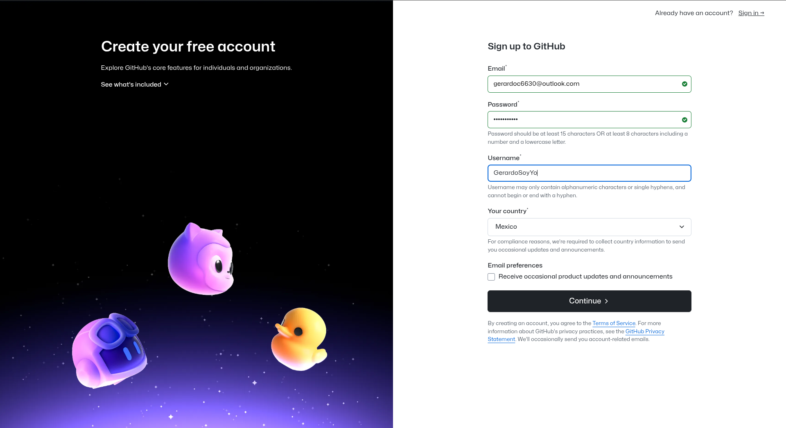 

# Crear una cuenta de Github


# Crear una cuenta de Github

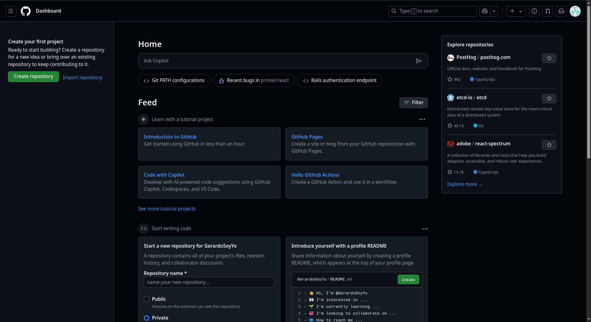

# Configuración de Git

Crea una llave SSH para autenticarte en GitHub. Puedes hacerlo con el siguiente comando:

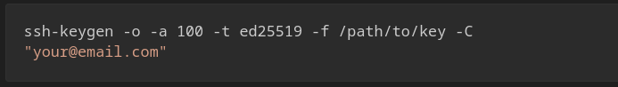

# Configuración de Git
Añade la llave pública a tu cuenta de GitHub.


# Configuración de Git
Configura tu nombre de usuario y correo electrónico en Git. Esto es importante para que tus commits se registren correctamente.\

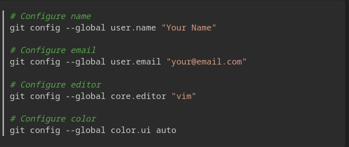

# Creación de un repositorio en GitHub

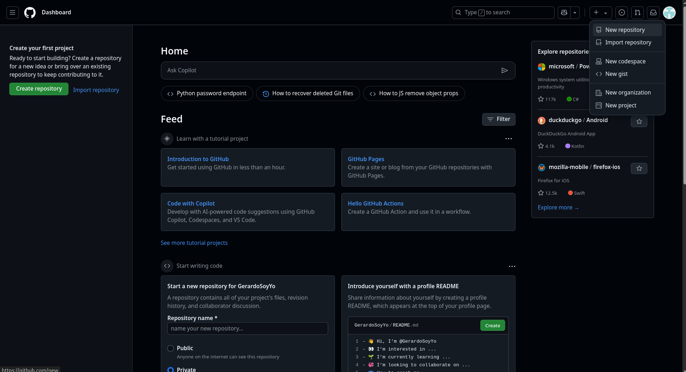

# Creación de un repositorio en GitHub

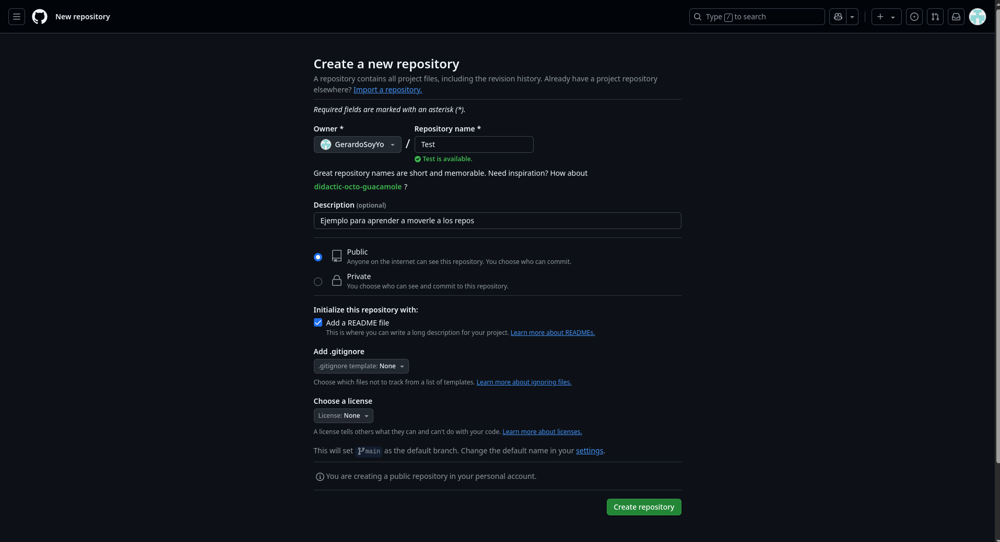

# Creación de un repositorio en GitHub
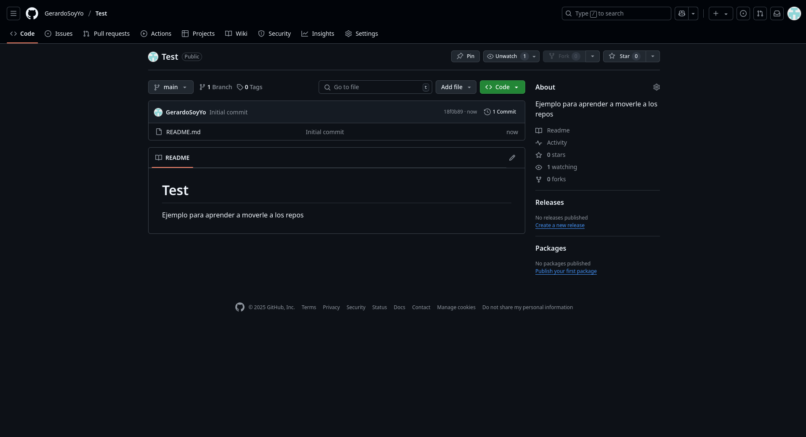

# Configuración de un Repositorio


# Configuración de un Repositorio


# Configuración de un Repositorio

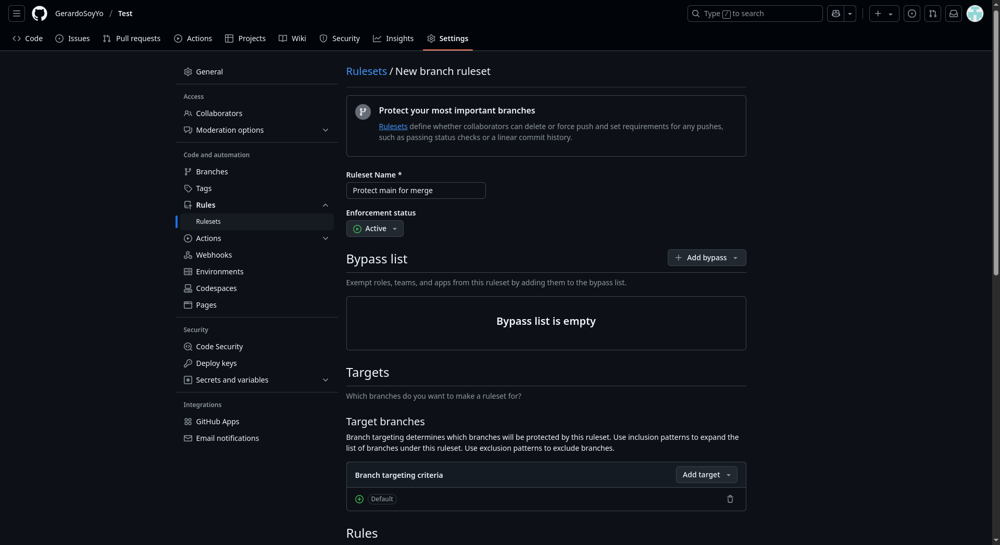

# Configuración de un Repositorio

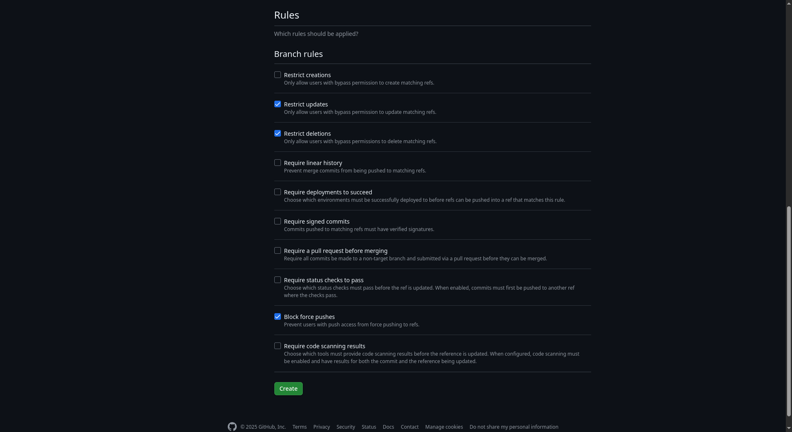

# Manejo de Ramas

Las ramas son una característica fundamental de Git y GitHub que permiten a los desarrolladores trabajar en diferentes versiones de un proyecto simultáneamente.

Las ramas son útiles para:

- **Desarrollo paralelo**

- **Pruebas y experimentación**

- **Revisión de código**

- **Mantenimiento**

- **Despliegue**

# Tipos de Ramas

En GitHub, existen varios tipos de ramas que se utilizan para diferentes propósitos en el desarrollo de software. Algunos de los tipos de ramas más comunes son:

## Ramas Locales

Es una rama que solo existe en tu entorno de trabajo. Estas son creadas, y son las que puedes modificar y gerstionar dentro de tu equipo. 

## Caracteristicas 

- **Visible solo localmente**

- **No se pueden compartir directamente**

- **Independientes**

- **Trabajo diario**

# Tipos de Ramas
## Ramas Locales

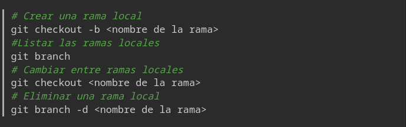

# Tipos de Ramas

## Ramas Remotas

Es una rama que existe desde un repositorio remoto. Estas se utilizan para compartir tu trabajo con otros desarrolladores o para mantener una versión centralizada del proyecto.

## Caracteristicas

- **Visibles para todos los colaboradores**

- **Sincronización con el repositorio remoto**

- **Acceso Compartido**

# Tipos de Ramas
## Ramas Remotas

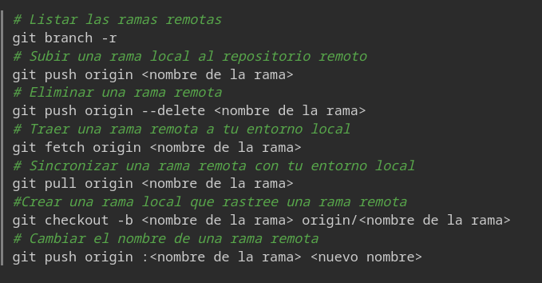

# Pull y Push
## Pull

- Es uno de los más utilizados en Github.

- Se utiliza para descargar cambios desde un repositorio remoto y aplicarlos a una rama local.

- Es un comando que combina dos acciones: `git fetch` y `git merge`.

Su sintaxis es la siguiente:

```bash
git pull origin <nombre de la rama>
```
# Pull Y Push
## Push

Lo que hace es "empujar" tus commits locales al repositorio remoto para que otros desarrolladores puedan ver tus cambios.

```bash
git push origin <nombre de la rama>
```

# Pull y Push


# Clasificación de una rama

- **Rama principal (main o master)**

- **Ramas de características (feature branches)**

- **Ramas de corrección de errores (fix branches)**


# Flujo de trabajo básico de git
El flujo de trabajo básico con Git implica los siguientes pasos:

1. **Clonar un repositorio**
    - Clonar un repositorio remoto a tu máquina local.
    - Comando: `git clone <URL del repositorio>`.
2. **Crear una rama**
    - Crear una nueva rama para trabajar en una característica o corrección de errores.
    - Comando: `git checkout -b <nombre de la rama>`.
3. **Asegurate de trabajar con los ultimos cambios**
    - Asegúrate de que tu rama esté actualizada con la rama principal (main o master).
    - Comando: `git pull origin <nombre de la rama>`.
4. **Realizar cambios**
    - Realizar cambios en el código fuente en la nueva rama.

# Flujo de trabajo básico de git

5. **Agregar cambios**
    - Agregar los cambios realizados al área de preparación (staging area).
    - Comando: `git add <archivo>` o `git add .` para agregar todos los archivos.
6. **Confirmar cambios**
    - Realiza una snapshot con los cambios más significativos de tu rama.
    - Comando: `git commit -m "Descripción de los cambios"`.
7. **Sincronizar cambios**
    - Sincroniza tu rama con el repositorio remoto.
    - Comando: `git push origin <nombre de la rama>`.

# Flujo de trabajo básico de git
8. **Crear un Pull Request**
    - Crea un Pull Request (PR) en GitHub para solicitar la revisión y fusión de tus cambios en la rama principal.
9. **Revisar y fusionar**
    - Revisa los comentarios y sugerencias de otros desarrolladores en el PR.
    - Si todo está bien, fusiona tu rama con la rama principal (main o master).
10. **Eliminar la rama**
    - Una vez que la fusión se haya completado, puedes eliminar la rama que creaste.
    - Comando: `git branch -d <nombre de la rama>` para eliminar la rama local y `git push origin --delete <nombre de la rama>` para eliminarla del repositorio remoto.

# Clonando un repositorio

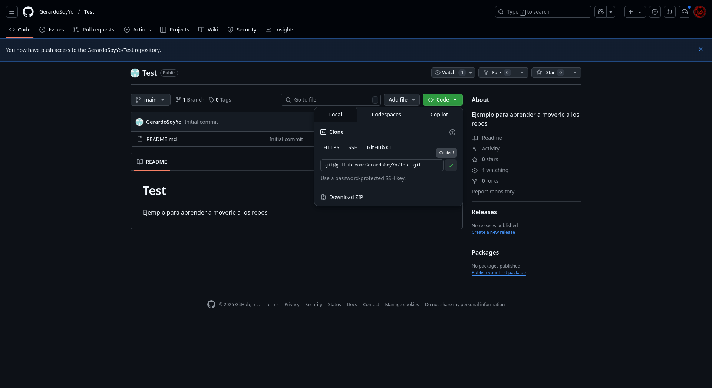

# Clonando un repositorio

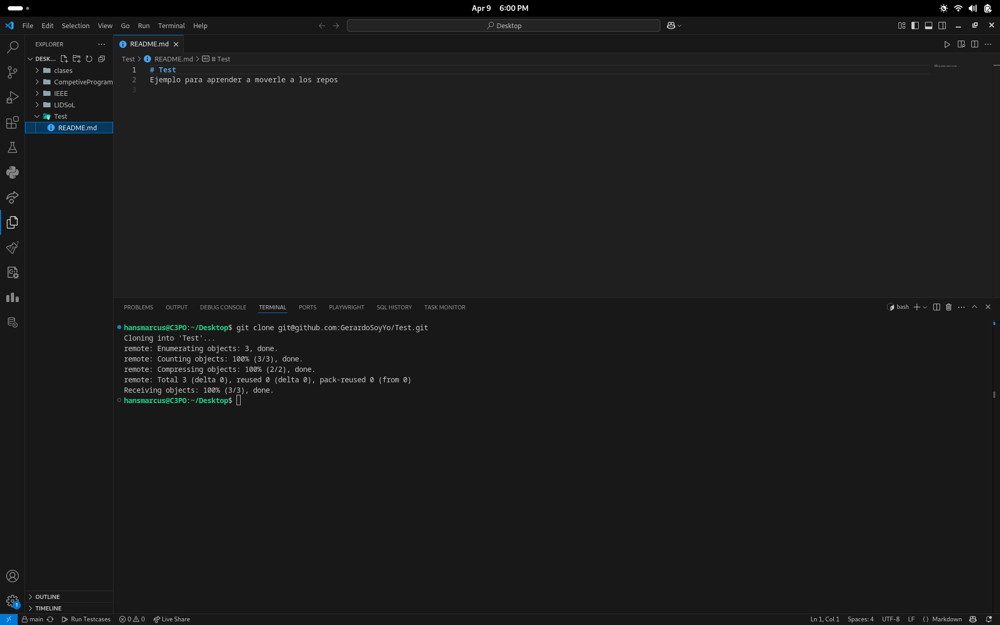{ width=95% }

# Como hacer un Fork

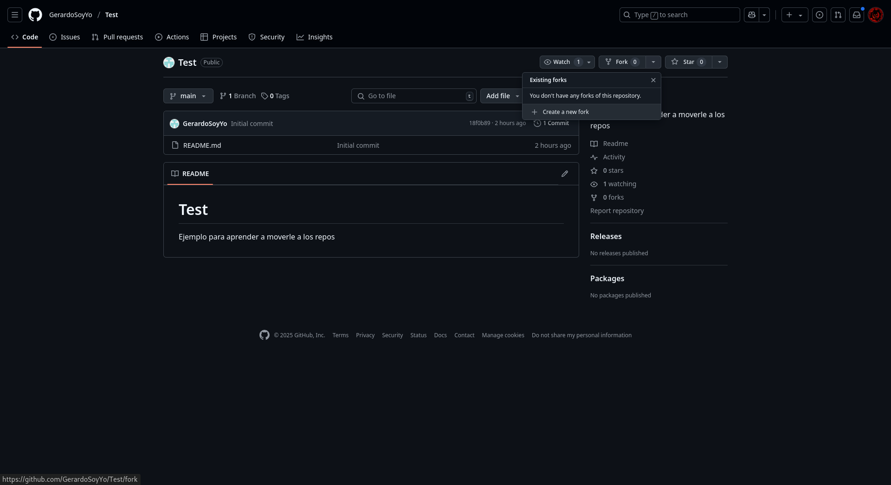

# Como hacer un Fork


# Como hacer un Pull Request

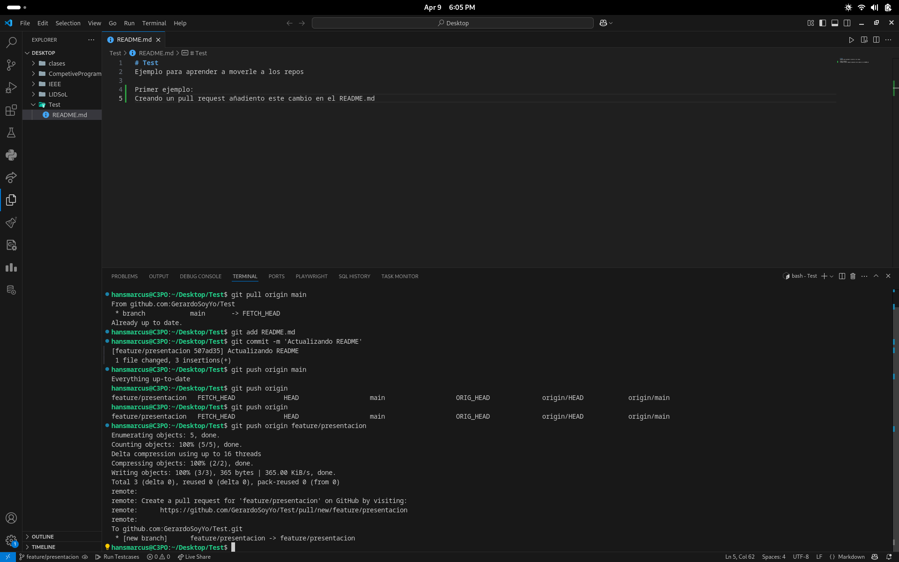{ width=95% }

# Como hacer un Pull Request

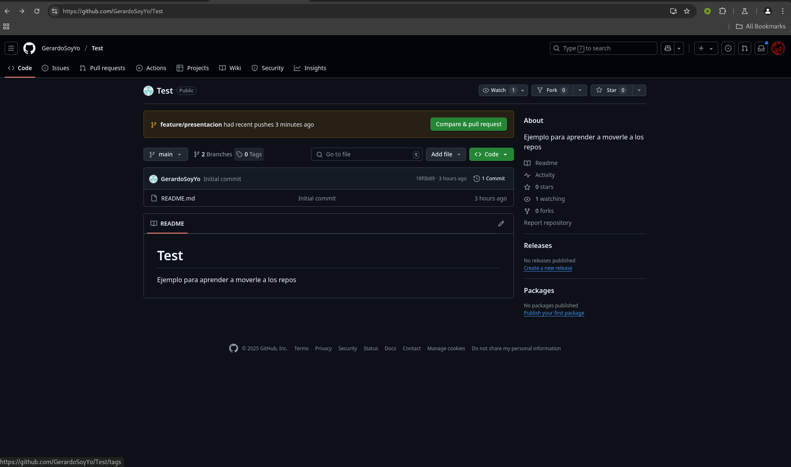

# Como hacer un PULL Request

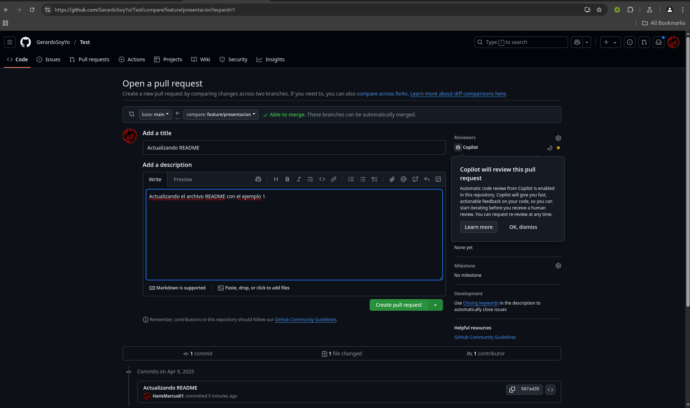

# Como hacer un PULL Request

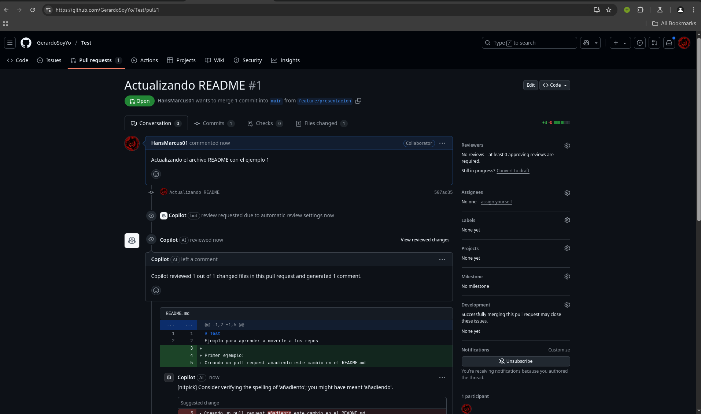

# Como hacer un PULL Request

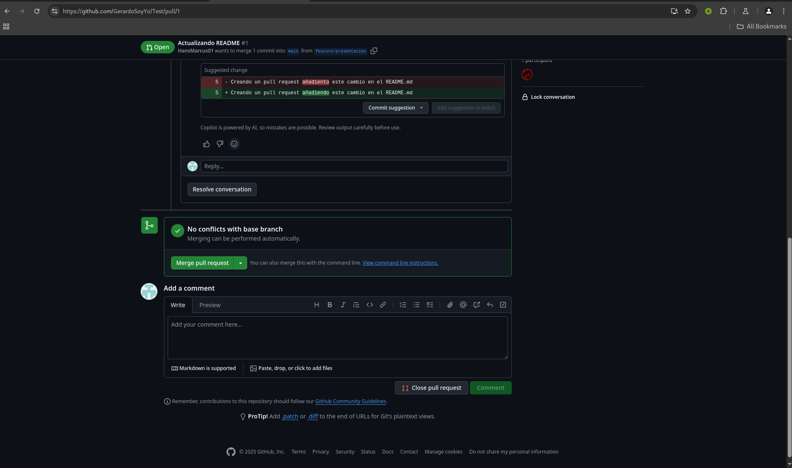

## Qué tipo de archivos se suben a github

GitHub es una plataforma de desarrollo colaborativo que permite a los desarrolladores almacenar y gestionar su código fuente. En GitHub, puedes subir una variedad de archivos relacionados con tu proyecto, incluyendo:

1. **Código fuente**

    - .py, .java, .js, .c, .html, .css, .cpp, etc.


2. **Documentación**

    - Archivos .md (Markdown), .tex (Latext), .rst(reStructuredText) 

3. **Archivos de configuración**

    - .gitignore, .json, .ymal, .xml, .ini.

4. **Imágenes y recursos multimedia**

    - .png, .jpg, .gif, .svg, etc.

5. **Archivos de datos**

    - .csv, .json, .xml

# Bibliografía

- https://git-scm.com/book/en/v2
- https://marklodato.github.io/visual-git-guide/index-es.html
- https://blog.kinto-technologies.com/posts/2023-03-07-From-Git-flow-to-GitHub-flow/
