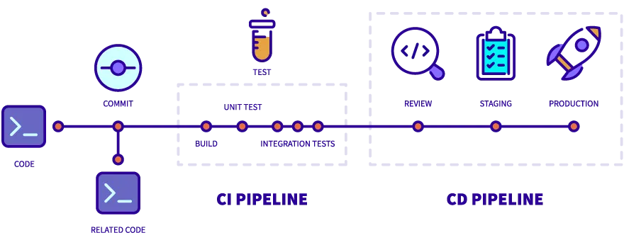

# Información del Curso

## Tiempo estimado

Aproximadamente 60 minutos.

## Objetivos

Que los participantes entiendan:

- Qué es el CI/CD y cómo se relaciona con Git
- Cómo crear un flujo de trabajo básico en GitHub Actions
- Cómo utilizar github actions para realizar pruebas automatizadas

# Integración continua (CI)

Es una práctica utilizada al desarrollar software para integrar código que es compartido por varios desarrolladores. Cada integración verifica que cada cambio realizado en el código fuente se integre correctamente y no rompa la funcionalidad del software. Esto se logra mediante la ejecución de pruebas automatizadas que verifican que el código funciona como se espera.

# Despliegue continuo (CD)

Es una práctica durante el desarrollo de software donde una vez se cuenta con una integración continua, se despliega automáticamente el código en un entorno de pruebas o producción. Esto permite a los desarrolladores y testers verificar que todo funciona en un entorno real.

# GitOps, ¿Qué tiene que ver con git?

GitOps es una práctica que utiliza Git como la única fuente de verdad para la infraestructura y las aplicaciones. Esto significa que todos los cambios en la infraestructura y las aplicaciones se realizan a través de Git, lo que permite un control de versiones completo y una auditoría de cambios.

# Flujo de trabajo



# Ventajas de CI/CD

- Mejora la calidad del software
- Reduce el tiempo de entrega
- Aumenta la colaboración entre equipos
- Facilita la detección de errores
- Permite una mejor gestión de la infraestructura
- Facilita la auditoría de cambios
- Mejora la seguridad
- Permite una mejor gestión de la configuración
- Facilita la recuperación ante desastres
- Permite una mejor gestión de la infraestructura como código (IaC)

# Herramientas

Algunas de las herramientas más populares para CI son:

- Jenkins
- Travis CI
- Drone.io
- Github Actions / Gitlab CI

# Github Actions

### ¿Qué es?

Es una de las herramientas más populares pues permite crear flujos de CI/CD directamente sobre Github.

## ¿Para qué sirve?

A partir de un evento (push, pull request, issue, etc.) se puede ejecutar un flujo de trabajo (workflow) que puede contener uno o más trabajos (jobs). A partir del resultado de los trabajos es posible realizar acciones como desplegar el código en un entorno de producción, enviar un correo electrónico, etc.


# Github Workflows

```
name: CI/CD
on:
  push:
    branches:
      - main
jobs:
    build:
        runs-on: ubuntu-latest
        steps:
        - name: Checkout code
            uses: actions/checkout@v2
        - name: Build container
            run: podman build -t my-app .
```

# Fuentes

- [CI/CD diagrama](https://blog.gogroup.co/advanced-ci-cd-pipeline-in-node-js-with-github-actions-and-slack-9050c3c5aaaf)


